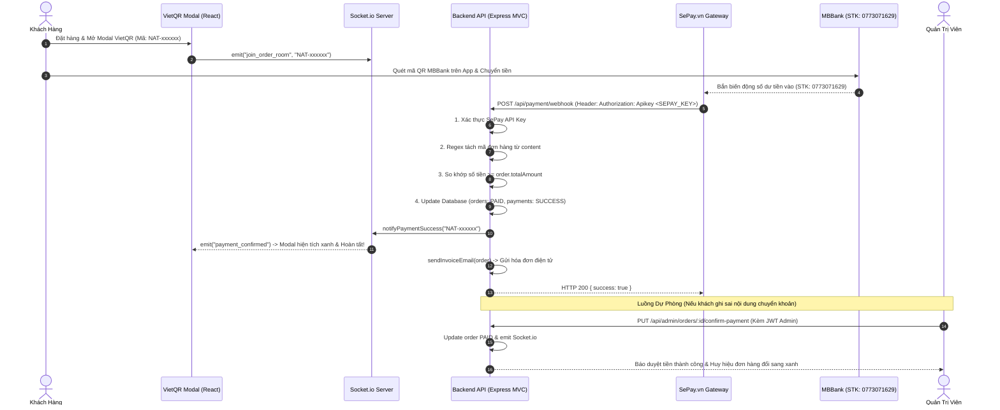

# Design Specification: SePay Automated VietQR Payment Webhook & Admin Reconciliation

## 1. Overview
Hệ thống tự động xác nhận chuyển tiền ngân hàng cho **NAT Computer** tích hợp với nền tảng **SePay.vn** (Cổng Webhook biến động số dư VietQR hàng đầu Việt Nam) kết nối trực tiếp với tài khoản MBBank:
- **Ngân hàng:** Ngân hàng Quân Đội (MBBank - Mã: `MB`)
- **Số tài khoản:** `0773071629`
- **Chủ tài khoản:** `NGO ANH TU`

Hệ thống hoạt động theo cơ chế kép (Hybrid):
1. **Tự động 100% qua SePay Webhook:** Khi khách hàng chuyển khoản quét mã VietQR trên web, MBBank nhận tiền, SePay lập tức gửi Webhook bảo mật về server NAT Computer trong 1–3 giây. Hệ thống tự động bóc tách mã đơn hàng, đối soát số tiền, chuyển trạng thái `PAID`, phát sự kiện Realtime Socket.io cho khách hàng và gửi email hóa đơn VAT điện tử.
2. **Duyệt thủ công trên Admin Dashboard (Manual Fallback):** Quản trị viên có thể xem danh sách đơn chờ thanh toán và bấm duyệt tiền trực tiếp cho các trường hợp khách chuyển thiếu, chuyển sai nội dung chuyển khoản hoặc SePay gặp sự cố mạng.

---

## 2. Architecture & Data Flow



---

## 3. Detailed Component Specifications

### 3.1. Environment Variables Configuration (`backend/.env`)
```ini
# Cấu hình SePay Webhook Authentication
SEPAY_API_KEY=nat_sepay_webhook_secret_key_2026_@!
SEPAY_WEBHOOK_URL=/api/payment/webhook
```

### 3.2. Webhook Endpoint (`POST /api/payment/webhook`)

#### A. Xác thực bảo mật (Authentication):
- SePay gửi khóa API qua header: `Authorization: Apikey <SEPAY_API_KEY>` (hoặc `Authorization: Bearer <SEPAY_API_KEY>`).
- Endpoint cũng hỗ trợ query string `?apiKey=<SEPAY_API_KEY>` dự phòng.
- Nếu khóa không khớp với biến môi trường `SEPAY_API_KEY`, hệ thống phản hồi ngay:
  ```json
  { "error": "Unauthorized: Invalid SePay API Key" } // HTTP 401
  ```

#### B. Cấu trúc SePay Webhook Payload:
```json
{
  "id": 1289410,
  "gateway": "MBBank",
  "transactionDate": "2026-09-22 22:45:00",
  "accountNumber": "0773071629",
  "code": null,
  "content": "NAT 889412 Nguyen Van A chuyen tien",
  "transferType": "in",
  "transferAmount": 25000000,
  "accumulated": 50000000,
  "subAccount": null,
  "referenceCode": "MB12345678",
  "description": "NAT 889412"
}
```

#### C. Thuật toán Xử lý & Đối soát (Reconciliation Algorithm):
1. **Lọc chiều giao dịch:** Chỉ xử lý khi `transferType === 'in'` (tiền vào).
2. **Bóc tách mã đơn hàng:**
   - Quét cả trường `content` và `description`.
   - Sử dụng Regex: `/NAT[-\s]*([0-9A-Za-z]+)/i`.
   - Kết quả chuẩn hóa: ví dụ `NAT 889412` -> `NAT-889412` hoặc `NAT-889412`.
3. **Kiểm tra trạng thái đơn hàng (Idempotency):**
   - Tra cứu đơn qua `OrderModel.getById(orderId)`.
   - Nếu đơn hàng đã là `PAID`: trả về HTTP 200 `{ success: true, message: "Order already processed" }` tránh việc gửi email hay xử lý lặp lại.
4. **Kiểm tra số tiền:**
   - `transferAmount >= order.totalAmount`.
5. **Cập nhật & Phát sự kiện:**
   - Gọi `OrderModel.updatePaymentSuccess(orderId, referenceCode || transactionDate)`.
   - Gọi `notifyPaymentSuccess(orderId, { amount, gateway: 'MBBank', transactionCode })`.
   - Gọi `sendInvoiceEmail(order)`.

---

### 3.3. Admin Manual Approval Endpoint (`PUT /api/admin/orders/:id/confirm-payment`)
- **Phân quyền:** Yêu cầu Token JWT của Admin (`verifyToken`, `requireAdmin`).
- **Nghiệp vụ:**
  - Cập nhật trạng thái đơn hàng sang `PAID` và `PROCESSING`.
  - Cập nhật bản ghi thanh toán sang `SUCCESS`.
  - Phát sự kiện Realtime Socket.io cho khách hàng (nếu khách vẫn đang mở modal).
  - Tự động gửi email hóa đơn điện tử cho khách.
  - Phản hồi đơn hàng đã được cập nhật.

---

### 3.4. Giao diện Quản trị (`frontend/src/pages/AdminPage.jsx`)
- Trong bảng danh sách đơn hàng (`activeMenu === 'orders'`), với mỗi đơn hàng có `paymentStatus !== 'PAID'`:
  - Hiển thị nút bấm màu xanh lá: **"Duyệt Nhận Tiền"** với biểu tượng `CheckCircle2`.
  - Hiển thị Modal / Popup xác nhận nhanh: *"Xác nhận đã nhận đủ số tiền ...đ từ khách hàng ... qua tài khoản MBBank?"*
  - Khi xác nhận thành công: gọi API `api.confirmAdminOrderPayment(orderId)`, hiển thị Toast thông báo và cập nhật tức thì trạng thái trên bảng.

---

## 4. Verification & Testing Matrix (TDD)
- **Unit & Integration Tests (`backend/paymentWebhook.test.js`):**
  1. `POST /api/payment/webhook` từ chối nếu không có hoặc sai `SEPAY_API_KEY` (HTTP 401).
  2. `POST /api/payment/webhook` xử lý thành công payload SePay hợp lệ, bóc tách đúng mã đơn, cập nhật DB và phát socket (HTTP 200).
  3. `POST /api/payment/webhook` đảm bảo tính Idempotent khi SePay gửi trùng webhook.
  4. `POST /api/payment/webhook` từ chối nếu số tiền chuyển khoản không đủ với tổng đơn.
  5. `PUT /api/admin/orders/:id/confirm-payment` duyệt tiền thủ công thành công với tài khoản Admin và từ chối tài khoản không phải Admin.
- Đảm bảo toàn bộ 31 backend tests và 49 frontend tests hiện có tiếp tục vượt qua 100%.
